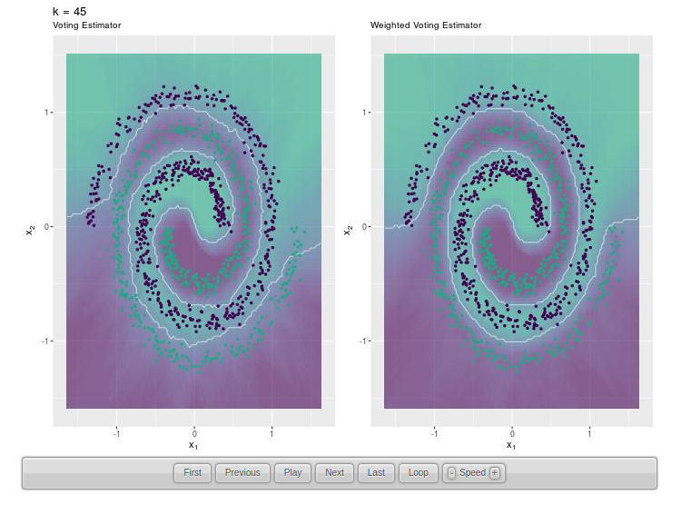
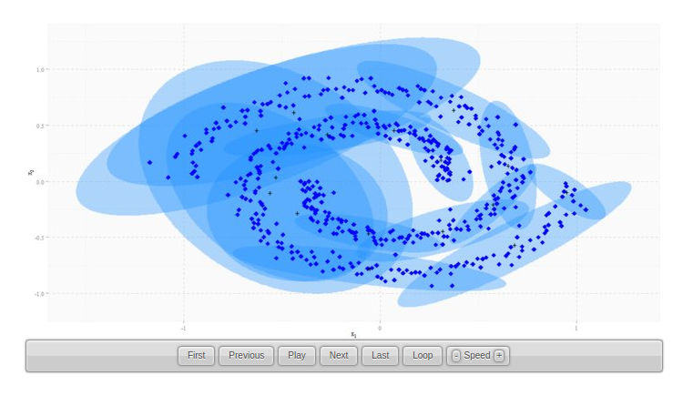
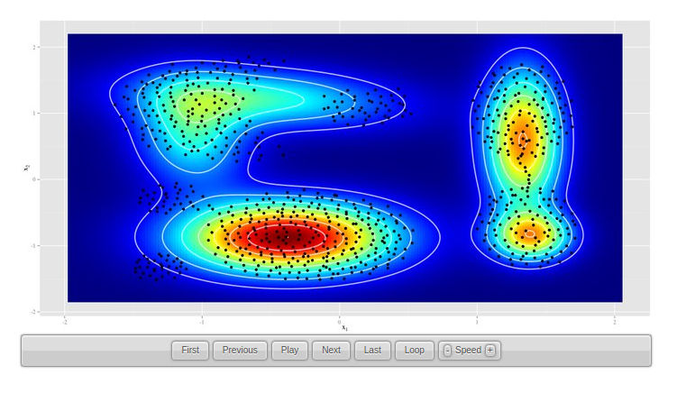
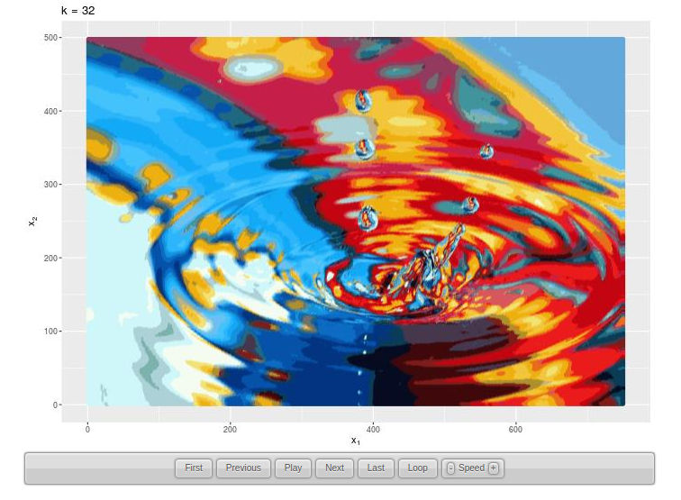

```{r setup, include=FALSE}
knitr::opts_chunk$set(echo = TRUE, fig.align = 'center')
```

> Understanding Machine Learning through Animated Visualizations 

This repository contains the source code for **animated visualizations** of some famous **machine learning** algorithms. They were created using the `R` package `animation`, and ilustrate algorithm convergence and the effect of hyper-parameter tuning. The animations available so far are:

- **XGBoost** decision boundary as **iterations** proceed:

```{r, out.width="75%", fig.align='center', echo=FALSE}
knitr::include_graphics("./img/xgb-iterations.jpg")
```

<a href="https://davpinto.github.io/ml-simulations/#gradient-boosting-machine-iterations" target="_blank">+ View Animation</a>

----

- **KNN** decision boundary varying the number of nearest neighbors $k$.

```{r, out.width="75%", fig.align='center', echo=FALSE}

```

<a href="https://davpinto.github.io/ml-simulations/#k-nearest-neighbors-classifier" target="_blank">+ View Animation</a>

----

- Multivariate **Gaussian Mixture Models** (GMMs) fitting by **EM algorithm**.

```{r, out.width="75%", fig.align='center', echo=FALSE}

```

<a href="https://davpinto.github.io/ml-simulations/#expectation-maximization-algorithm" target="_blank">+ View Animation</a>

----

- Multimodal **Density Estimation** using GMMs.

```{r, out.width="75%", fig.align='center', echo=FALSE}

```

<a href="https://davpinto.github.io/ml-simulations/#gaussian-mixture-density" target="_blank">+ View Animation</a>

----

- **Tikhonov Regularization** effect in **Extreme Learning Machines** (ELMs).

```{r, out.width="75%", fig.align='center', echo=FALSE}
knitr::include_graphics("./img/elm-regularization.jpg")
```

<a href="https://davpinto.github.io/ml-simulations/#regularized-extreme-learning-machine" target="_blank">+ View Animation</a>

----

- **Image Segmentation** using **K-means**.

```{r, out.width="75%", fig.align='center', echo=FALSE}

```

<a href="https://davpinto.github.io/ml-simulations/#image-segmentation-with-k-means" target="_blank">+ View Animation</a>

----

- Image **Reconstruction** using **Principal Components Analysis** (PCA).

```{r, out.width="75%", fig.align='center', echo=FALSE}
knitr::include_graphics("./img/pca-reconstruction.jpg")
```

<a href="https://davpinto.github.io/ml-simulations/#image-reconstruction-with-principal-components-analysis" target="_blank">+ View Animation</a>

----

Take a look at the **[website](https://davpinto.github.io/ml-simulations)** and have fun!
