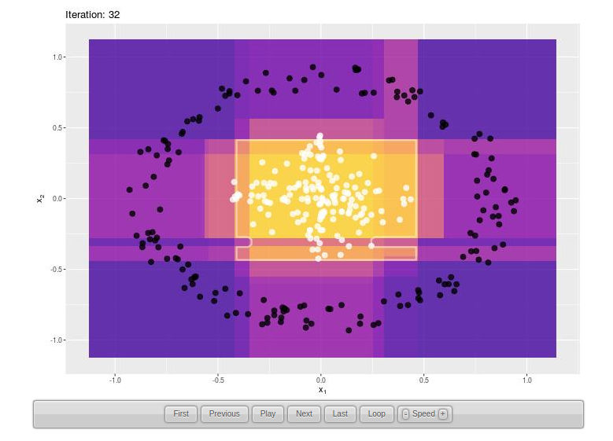
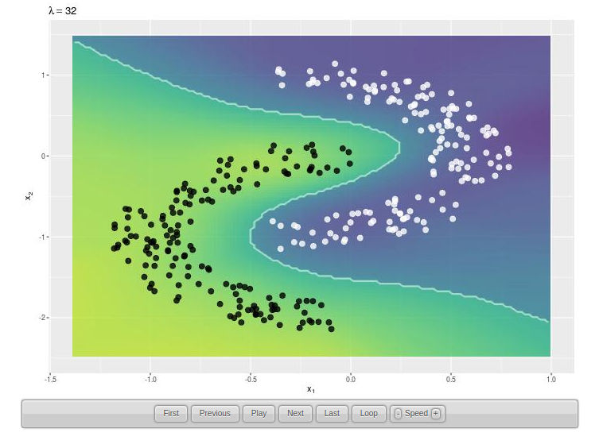
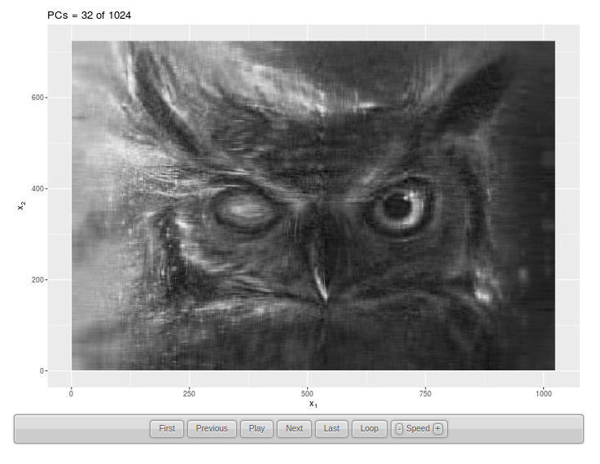

```{r setup, include=FALSE}
knitr::opts_chunk$set(echo = TRUE, fig.align = 'center')
```

> Understanding Machine Learning through Animated Visualizations 

This repository contains the source code for **animated visualizations** of some famous **machine learning** algorithms. They were created using the `R` package `animation`, and ilustrate algorithm convergence and the effect of hyper-parameter tuning. The simulations available so far are:

- **XGBoost** decision boundary as **iterations** proceed.

```{r, out.width="75%", fig.align='center', echo=FALSE}

```

- **KNN** decision boundary varying the number of nearest neighbors $k$.

- Multivariate **Gaussian Mixture Models** (GMMs) fitting by **EM algorithm**.

- Multimodal **Density Estimation** using GMMs.

- **Tikhonov Regularization** effect in **Extreme Learning Machines** (ELMs).

```{r, out.width="75%", fig.align='center', echo=FALSE}

```

- **Image Segmentation** using **K-means**.

- Image **Reconstruction** using **Principal Components Analysis** (PCA).

```{r, out.width="75%", fig.align='center', echo=FALSE}

```

****

Take a look at the **[website](https://davpinto.github.io/ml-simulations)** and have fun!
