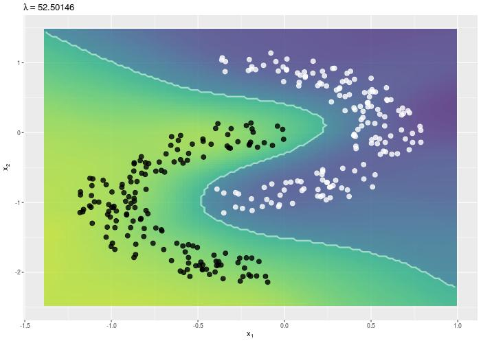

Machine Learning Simulations
================

> Understanding Machine Learning through Animated Visualizations

This repository contains the source code for **animated visualizations** of some famous **machine learning** algorithms. They were created using the `R` package `animation`, and ilustrate algorithm convergence and the effect of hyper-parameter tuning. The simulations available so far are:

-   Multivariate **Gaussian Mixture Models** (GMMs) fitting by **EM algorithm**.

-   Multimodal **Density Estimation** using GMMs.

-   **Tikhonov Regularization** effect in **Extreme Learning Machines** (ELMs).

-   **Image Segmentation** using **K-means**.

-   Image **Reconstruction** using **Principal Components Analysis** (PCA).

------------------------------------------------------------------------

Take a look at the **[website](https://davpinto.github.io/ml-simulations)** and have fun!
